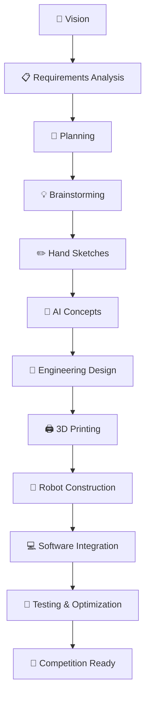

# BirTics | WRO 2026 Future Engineers

## About the Team

**BirTics** is a robotics team participating in the **WRO 2026 Future Engineers** category.

We aim to build an autonomous self-driving robot through a clear engineering process based on planning, research, design, construction, testing, and continuous improvement.

---

## Project Vision

Our vision is to develop a reliable autonomous vehicle that can complete the WRO challenge by following a structured development journey from idea to competition-ready robot.

---

## Development Roadmap## 🚗 BirTics Development Path

---

أو النسخة الأحلى لــ WRO:

````markdown
## 🚗 BirTics Development Journey


