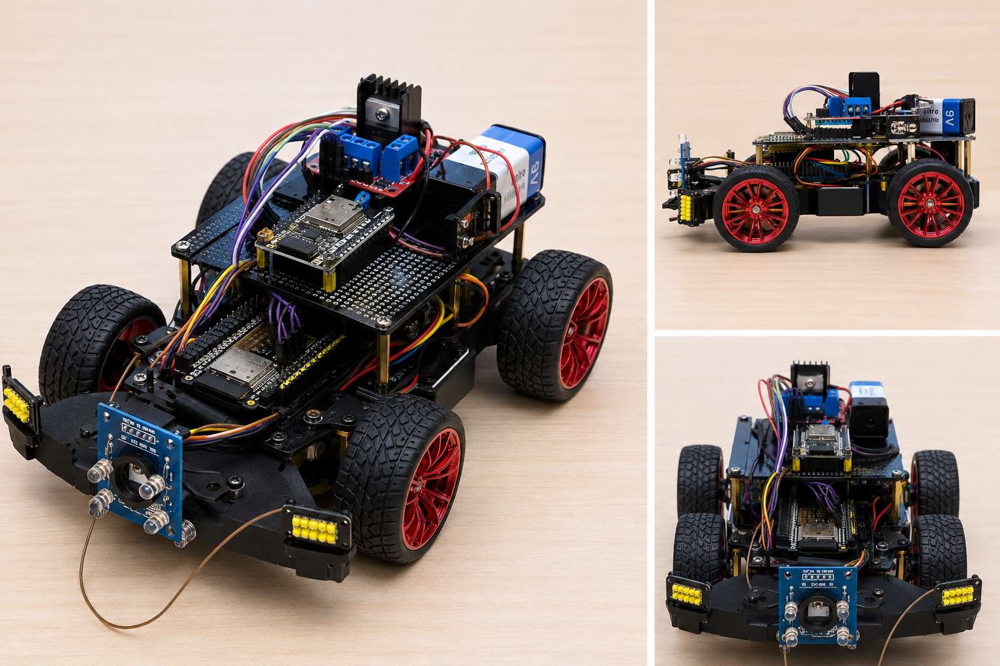
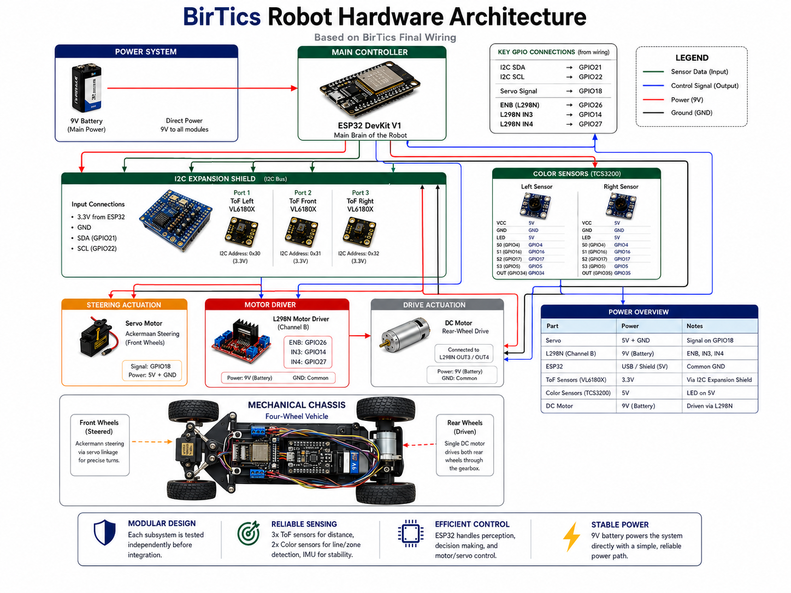

# 🚗 BirTics

### Autonomous Self-Driving Vehicle

**WRO Future Engineers 2026**

Birzeit University • Palestine 🇵🇸

 

 

*A modular autonomous robot engineered through iterative design, testing, and continuous improvement.*

 

## 👥 Meet the Team

 

**Meet the BirTics team — click the image to learn more about our roles and responsibilities.**

---

# 📖 Executive Summary

# 📖 Executive Summary

BirTics is a three-member engineering team participating in the **WRO Future Engineers 2026** competition.

Our objective is to design, build, and validate an autonomous vehicle capable of completing the Future Engineers challenge while documenting every major engineering decision throughout the development process.

This repository serves as the project's engineering notebook. It contains the complete documentation of our mechanical design, electronics architecture, software implementation, testing activities, and development history, allowing judges to easily understand both the final solution and the reasoning behind it.

# 🗺️ Repository Navigation Guide

If this is your first visit to our repository, we recommend exploring the project in the following order. This path follows the same engineering workflow our team used throughout development.

| Step | Document | What You'll Find |
|:---:|----------|------------------|
| **①** | 👥 **[Team Roles](docs/team-roles.md)** | Meet the team and understand each member's responsibilities. |
| **②** | 📖 **[Engineering Journal](docs/engineering-journal.md)** | Follow the complete engineering journey, major design decisions, and project evolution. |
| **③** | ⚙️ **[Mechanical Design](docs/mechanical-design/README.md)** | Explore the chassis design, hardware evolution, and mechanical implementation. |
| **④** | 🔌 **[Power & Sensors](docs/power-and-sensors/README.md)** | Learn about the electronics architecture, wiring, sensors, and power distribution. |
| **⑤** | 💻 **[Software Architecture](docs/software-architecture/README.md)** | Understand the software structure, navigation strategy, and control algorithms. |
| **⑥** | 🧪 **[Testing](docs/testing/README.md)** | Review subsystem validation, integration tests, and experimental results. |
| **⑦** | 📂 **[Source Code](code/)** | Explore the robot firmware, supporting software, and implementation files. |

> **Recommended reading order:** Team → Engineering Journal → Mechanical Design → Power & Sensors → Software → Testing → Code

# 🚀 Project at a Glance

| Category | Current Solution |
|-----------|------------------|
| Competition | WRO Future Engineers 2026 |
| Team | BirTics |
| University | Birzeit University |
| Robot Type | Autonomous Four-Wheel Vehicle |
| Controller | ESP32 DevKit V1 |
| Steering | Ackermann Steering |
| Drive System | Rear-Wheel Drive |
| Navigation | Sensor-Based Autonomous Navigation |
| Primary Sensors | VL6180X ToF + TCS3200 Color Sensors + MPU6050 |
| Development Stage | System Integration & Validation |

---

# 🚗 Robot Overview

BirTics is a four-wheel autonomous vehicle designed for the **WRO Future Engineers 2026** category. The robot follows a modular architecture, allowing each subsystem to be developed, tested, and improved independently before full system integration.

---

## Robot Configuration

| Component | Selected Solution |
|-----------|-------------------|
| **Chassis** | Four-wheel RC car platform |
| **Steering** | Ackermann steering with servo linkage |
| **Drive** | Rear-wheel DC motor |
| **Main Controller** | ESP32 DevKit V1 |
| **Motor Driver** | L298N |
| **Power Source** | 9V battery with regulated power distribution |
| **Distance Sensing** | 3 × VL6180X Time-of-Flight sensors |
| **Traffic Sign Detection** | 2 × TCS3200 Color Sensors |
| **Orientation** | MPU6050 IMU |
| **Programming Environment** | Arduino Framework (ESP32) |

---

### Engineering Approach

The robot has been designed around a modular philosophy. Each subsystem—including sensing, motion control, steering, and perception—is validated individually before being integrated into the complete autonomous platform. This workflow simplifies debugging, improves maintainability, and enables continuous refinement throughout development.

---
# 🖥️ Hardware Architecture

The BirTics robot is built around an ESP32-based modular hardware architecture. Each subsystem is connected to the ESP32 through dedicated communication interfaces, allowing the robot to process sensor data and control the actuators in real time.

  

The hardware consists of:

- ESP32 DevKit V1 as the main controller
- ESP32 Expansion Shield for sensor integration
- 3 × VL6180X Time-of-Flight sensors
- 2 × TCS3200 color sensors
- MPU6050 IMU
- L298N motor driver
- Ackermann steering servo
- Rear DC drive motor
- 9V battery power system

For detailed wiring and GPIO assignments, see the **[Power & Sensors](docs/power-and-sensors/README.md)** documentation.

# 💻 Software Architecture

The robot software is organized into independent functional layers. Each layer performs a specific task, allowing the system to remain modular, maintainable, and easy to debug.

| Layer | Responsibility |
|--------|----------------|
| **Perception** | Collect environmental information using ToF sensors, color sensors, and the IMU. |
| **Decision Making** | Process sensor readings, determine robot behavior, and generate navigation commands. |
| **Control** | Compute steering angles and motor speed using embedded control algorithms. |
| **Actuation** | Drive the steering servo and rear-wheel motor to execute movement. |

For a complete explanation of the software architecture, refer to the **[Software Architecture](docs/software-architecture/README.md)** documentation.

# 👥 Team BirTics

  <a href="docs/team-roles.md">📄 View Team Roles →</a>

---

# 📂 Repository Structure

The repository is organized around the engineering workflow used throughout the project.

| Folder | Description |
|---------|-------------|
| 📁 assets | Images, diagrams, renders, and project media |
| 📁 code | ESP32 firmware and software prototypes |
| 📁 docs | Engineering documentation and project records |

Each folder is designed to provide judges with a clear understanding of the project's design process, implementation, and validation.

---

### BirTics • WRO Future Engineers 2026

Designed, Built, and Documented by Students from **Birzeit University**

⭐ Engineering through Design • Testing • Continuous Improvement ⭐

