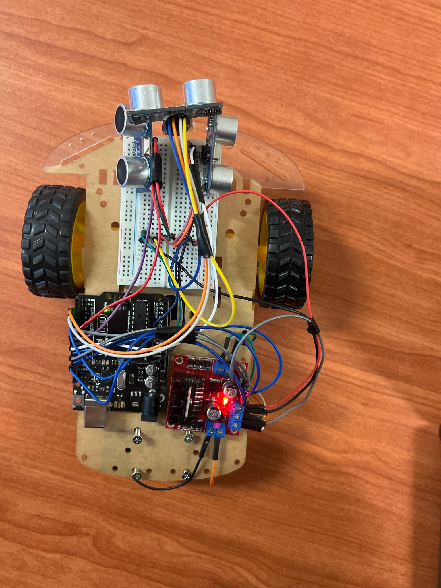
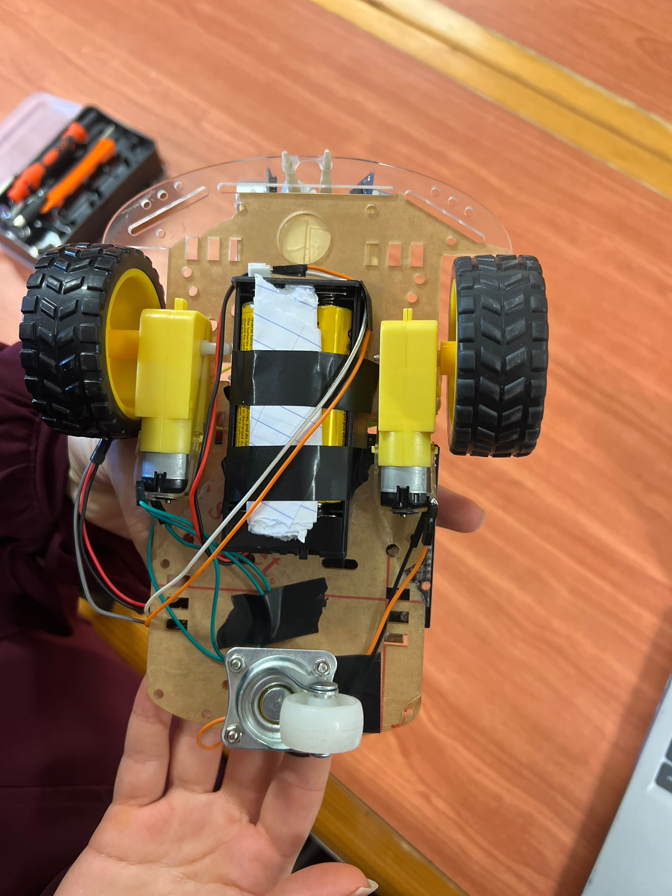
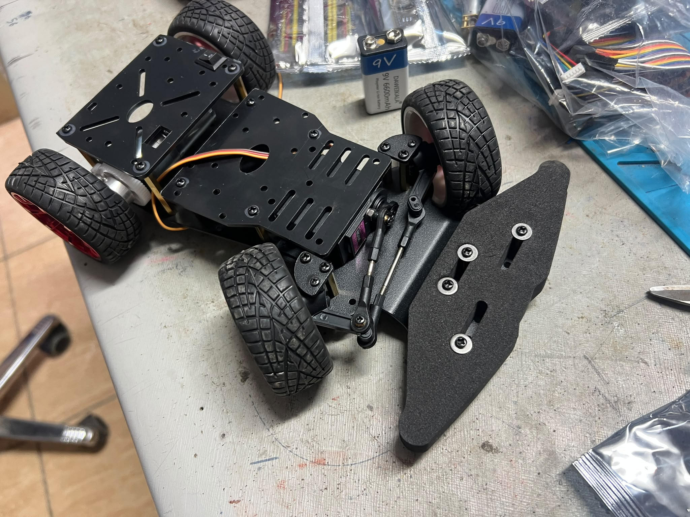

<!-- ===========================================================
     BirTics Engineering Journey
=========================================================== -->

<div align="center">

# 📖 Engineering Journey

### BirTics • WRO Future Engineers 2026


---

*"Good engineering is not only about building a robot.*

*It is about understanding why every design decision was made."*

</div>

---

# 📚 About This Document

Every successful engineering project evolves through experimentation, discussion, redesign, and continuous improvement.

This document records the engineering journey of **Team BirTics** throughout the development of our robot for the **WRO Future Engineers 2026** competition.

Rather than functioning as a meeting log or daily diary, this document focuses on the **engineering decisions** that shaped the project.

It explains:

- **What** decisions were made.
- **Why** they were made.
- **What alternatives were considered.**
- **How each decision influenced the next stage of development.**

The objective is to document not only the final robot, but also the reasoning behind its evolution.

---

# 🗺️ Document Structure

| Section | Purpose |
|----------|---------|
| 🌱 **Where It All Started** | Initial project vision and early planning |
| 🛠️ **Building the First Prototype** | First hardware implementation and lessons learned |
| 🔄 **A Change in Direction** | Why the original concept evolved |
| 🧠 **Choosing the Right Controller** | Raspberry Pi vs ESP32 |
| 📏 **Searching for More Reliable Sensors** | IR versus ToF evaluation |
| 🚗 **Moving to a Car-Like Platform** | Transition to the RC steering chassis |
| 🗂️ **Documentation Becomes Part of Engineering** | How documentation became part of development |
| 🔄 **Design Evolution** | Visual summary of the project's progression |
| ⚙️ **Current Architecture** | Current hardware status |
| 🏁 **Preparing for the Trial Competition** | Current development objectives |
| 🔍 **Engineering Reflections** | Lessons learned |
| 🚀 **Looking Ahead** | Future development roadmap |

---

> [!NOTE]
>
> This is a **living engineering document**.
>
> It is continuously updated as the robot evolves, ensuring that every important engineering decision remains documented and traceable throughout the project.

---

<div align="center">

### "Engineering is a journey of informed decisions—not a sequence of perfect first attempts."

**— Team BirTics**

</div>
# 🌱 Where It All Started

Every engineering project begins with an idea.

Some begin with a detailed plan, while others begin with a simple question.

For Team **BirTics**, the journey started in **early May 2026** when we decided to participate in the **WRO Future Engineers** competition. At that point, we did not have a complete robot design, a finalized hardware list, or a detailed development roadmap. What we had was a shared objective: to build an autonomous vehicle while learning through the engineering process.

Our first meetings focused on understanding the competition rules, discussing different technical approaches, and identifying the main systems the robot would eventually require. Instead of rushing into hardware selection, we spent time exploring possible solutions and understanding the challenges that lay ahead.

Like many student engineering projects, our earliest discussions were informal. Ideas were exchanged through conversations, sketches, and quick brainstorming sessions rather than structured documentation. Although this helped us explore different possibilities freely, it also made us realize how easy it is to lose valuable engineering decisions when they are not properly recorded.

This realization changed the way we approached the project.

Rather than treating documentation as something to complete after building the robot, we gradually made it part of the engineering process itself. GitHub became more than a place to store files—it evolved into a workspace where design decisions, technical discussions, documentation, and project progress could all be tracked together.

Looking back, this shift was one of the most valuable decisions we made during the early stages of development. It allowed us not only to document **what** we built, but also to preserve **why** each important decision was made.

> [!TIP]
> **Key Takeaway**
>
> One of the earliest lessons we learned was that engineering documentation should evolve alongside the robot itself. Recording the reasoning behind design decisions proved just as important as documenting the final implementation.

---
 # 🛠️ Building the First Prototype

With the project's initial direction becoming clearer, the team agreed that the next step was **not** to build the final robot immediately.

Instead, we chose to answer a simpler engineering question:

> **Can we successfully integrate a controller, sensors, and motors into a working autonomous platform before committing to a complete design?**

To answer this question, we built our first functional prototype on **19 May 2026**.

Rather than focusing on appearance or mechanical refinement, the objective was to validate the fundamental concepts of autonomous movement using simple and readily available components.

## Prototype Configuration

| Component | Purpose |
|-----------|---------|
| Arduino Uno | Main controller |
| Breadboard | Rapid prototyping and temporary wiring |
| L298N Motor Driver | Motor control |
| Ultrasonic Sensors | Basic obstacle detection |
| Two DC Motors | Robot movement |

This hardware combination allowed us to assemble a working robot quickly while keeping the design flexible enough for experimentation.

---

## Motion Strategy

The prototype was built around a **differential-drive** system.

Instead of using a steering mechanism, movement depended entirely on controlling the speed of the two DC motors.

- Driving forward required both motors to rotate at the same speed.
- Turning was achieved by creating a speed difference between the motors.
- During tighter turns, one motor slowed down—or stopped completely—while the other continued rotating, allowing the robot to rotate around one side.

Although simple, this approach enabled the team to verify the basic principles of autonomous movement without introducing unnecessary mechanical complexity during the early stages of development.

---
<p align="center">
  
</p>

<p align="center">
<b>Figure 1.</b> Top view of the first prototype assembled on <b>19 May 2026</b>.
</p>

---

<p align="center">
  
</p>

<p align="center">
<b>Figure 2.</b> Bottom view showing the differential-drive configuration using two independently controlled DC motors.
</p>
---

> [!NOTE]
> **Engineering Decision**
>
> The first prototype was intentionally designed as a learning platform rather than a competition-ready robot. Its purpose was to verify hardware integration, sensor communication, and basic motion control before investing time and resources into a more advanced mechanical design.

> [!IMPORTANT]
> **Why Build a Prototype First?**
>
> Building a simple prototype reduced engineering risk. Instead of making assumptions about how different components would interact, the team validated the core concepts experimentally before moving toward the final robot architecture.

> [!TIP]
> **Key Takeaway**
>
> The greatest success of the first prototype was not the robot itself—it was the engineering knowledge gained from building and testing it. Those lessons became the foundation for every major design decision that followed.

---
# 🔄 A Change in Direction

The first prototype successfully achieved its objective.

It demonstrated that the basic control system worked, confirmed that the selected components could operate together, and gave the team valuable practical experience. More importantly, it allowed us to evaluate our design from an engineering perspective rather than relying on assumptions.

As testing progressed, we realized that the prototype had already fulfilled its purpose.

Instead of continuing to improve the same platform, we stepped back and asked ourselves a more important engineering question:

> **Is this the architecture we want to continue developing for the final WRO robot?**

The answer was **no**.

Although the differential-drive prototype proved effective for learning and experimentation, it was never intended to become the robot that would represent the team in the competition.

Rather than investing additional effort into improving an educational platform, we decided to redesign the robot around a vehicle architecture that more closely reflected the concept of a real autonomous car.

This decision marked the first major redesign of the project.

---

## Why the Design Changed

The decision was not based on a failure of the prototype.

Instead, it reflected a natural progression in the engineering process.

The prototype answered the questions it was built to answer.

The next stage required a platform capable of supporting a more realistic steering system, improved mechanical integration, and future hardware expansion.

> [!WARNING]
> **Design Revision**
>
> The differential-drive prototype successfully validated the team's initial concepts. Rather than continuing to optimize that platform, the team deliberately transitioned toward a chassis better suited for the long-term goals of the project.

---

## Engineering Impact

This redesign changed the direction of the project in several ways.

| Before | After |
|---------|-------|
| Educational prototype | Competition-oriented platform |
| Differential-drive movement | Steering-based vehicle architecture |
| Temporary hardware layout | Expandable mechanical platform |
| Concept validation | Competition-focused development |

Instead of viewing the redesign as starting over, we considered it the next logical step in the project's evolution.

Every lesson learned from the prototype directly influenced the decisions that followed.

> [!TIP]
> **Key Takeaway**
>
> A successful prototype is not necessarily the one that becomes the final product. Its real value lies in reducing uncertainty and providing the knowledge needed to make better engineering decisions.

---
# 🚗 Moving to a Car-Like Platform

Once the decision to move away from the educational prototype had been made, the next challenge was selecting a mechanical platform that better matched the team's long-term objectives.

Rather than continuing with a differential-drive chassis, we decided to adopt a ready-made **RC steering chassis**, providing a structure much closer to a real autonomous vehicle.

This transition represented more than a hardware replacement—it marked a shift in the way we approached the entire project.

The new platform introduced a steering mechanism instead of relying on differences in motor speed to change direction, allowing the robot to better reflect the vehicle architecture expected in the **WRO Future Engineers** category.

---

## Why an RC Steering Chassis?

Several factors influenced this decision.

The new chassis offered:

- Front-wheel steering.
- Rear-wheel drive.
- Better mechanical stability.
- Improved weight distribution.
- More available space for electronics.
- Easier integration of sensors and future hardware.

Most importantly, it provided a stronger foundation for building the competition robot rather than continuing to develop a temporary prototype.

<p align="center">
  
</p>

<p align="center">
<b>Figure 3.</b> Ready-made RC steering chassis adopted as the new mechanical platform following the evaluation of the initial differential-drive prototype.
</p>
---

## Comparing Both Platforms

| First Prototype | Current Platform |
|-----------------|------------------|
| Educational chassis | RC steering chassis |
| Differential-drive turning | Mechanical front-wheel steering |
| Built for experimentation | Built for long-term development |
| Temporary hardware layout | Expandable competition platform |

---

> [!NOTE]
> **Engineering Decision**
>
> The RC steering chassis was selected because it better supported the long-term objectives of the project. Rather than optimizing a platform that had already fulfilled its purpose, the team chose to continue development on a structure more suitable for competition.

> [!IMPORTANT]
> **Engineering Perspective**
>
> This decision was not about replacing one chassis with another. It reflected a shift from validating engineering concepts to building a robot intended for continuous refinement and competition.

> [!TIP]
> **Key Takeaway**
>
> Choosing the right mechanical platform early creates a stronger foundation for every hardware and software decision that follows.

---
# 🧠 Choosing the Right Controller

With the mechanical direction of the project becoming clearer, the next major decision was selecting the robot's main controller.

The controller would serve as the central unit responsible for processing sensor data, executing the control algorithm, and coordinating communication between the robot's hardware components.

Rather than selecting the most powerful board available, we wanted a controller that matched the project's actual requirements while remaining practical in terms of cost, development time, and future expansion.

---

## Evaluating the Options

During the planning stage, two main platforms were considered:

- **Raspberry Pi**
- **ESP32**

The Raspberry Pi offered significantly higher computational performance and was particularly attractive because of its support for computer vision and image processing.

However, after comparing its capabilities with the immediate needs of the project, we concluded that most of its processing power would remain unused during the current development stage.

At the same time, its higher cost made it difficult to justify as the primary controller.

The ESP32, on the other hand, provided everything required for the current stage of development while keeping the system simpler and more affordable.

---

## Controller Comparison

| Raspberry Pi | ESP32 |
|--------------|--------|
| High computational power | Processing power suitable for the current project stage |
| Excellent for computer vision | Easy to integrate with embedded hardware |
| Higher cost | Lower cost |
| Linux-based environment | Real-time embedded controller |
| Better suited for future vision expansion | Better suited for current robot control |

---

> [!IMPORTANT]
> **Engineering Trade-off**
>
> The team selected the ESP32 as the primary controller for the current development stage because it provided the best balance between functionality, simplicity, availability, and cost. Rather than choosing the most powerful platform, we selected the one that best matched the project's current engineering requirements.

---

> [!NOTE]
> **Future Expansion**
>
> Although the Raspberry Pi was not selected as the primary controller, the possibility of integrating it in the future for computer vision remains open if the project's requirements evolve.

---

> [!TIP]
> **Key Takeaway**
>
> Engineering decisions should be driven by project requirements rather than hardware specifications. Selecting technology that appropriately matches the problem often leads to a more efficient and maintainable system.

---
# 📏 Searching for More Reliable Sensors

Selecting the robot's distance sensing system became one of the most important hardware decisions during the project.

Since the robot must operate autonomously, accurate and consistent distance measurements are essential for obstacle detection, navigation, and future decision-making.

Rather than selecting the first available sensor, we compared different technologies and evaluated how well they matched the project's requirements.

---

## Initial Consideration

Infrared (IR) sensors were among the first options considered.

Their low cost, simple interface, and widespread availability made them an attractive starting point for the project.

However, after researching their expected performance and comparing them with the level of precision required for autonomous navigation, we concluded that IR sensors would not provide the measurement reliability we were aiming for.

Although suitable for many embedded applications, they were not the best match for our objectives.

---

## Moving Toward Time-of-Flight Sensors

To achieve more accurate distance measurements, we began evaluating **Time-of-Flight (ToF)** sensors.

Unlike IR sensors, ToF technology measures distance directly based on the travel time of light, providing more stable and precise readings.

This made ToF sensors a more suitable choice for the navigation strategy we wanted to develop.

---

## A Software Challenge

Choosing ToF sensors introduced an additional challenge.

All ToF sensors initially share the same default **I²C address**, which means multiple sensors cannot communicate on the same bus without an initialization procedure that assigns different addresses.

The team recognized this software challenge before making the final decision.

Rather than avoiding the problem by selecting simpler hardware, we decided that the improvement in measurement quality justified the additional implementation effort.

---

## Sensor Comparison

| Infrared Sensors | Time-of-Flight Sensors |
|------------------|------------------------|
| Simple interface | Higher measurement accuracy |
| Low cost | More reliable readings |
| Easy integration | Better suited for autonomous navigation |
| Lower measurement consistency | Requires I²C address management when multiple sensors are used |

---

> [!IMPORTANT]
> **Engineering Trade-off**
>
> The team deliberately accepted additional software complexity in exchange for more reliable sensor data. Accurate measurements were considered more valuable than simplifying implementation.

---

> [!NOTE]
> **Engineering Decision**
>
> Time-of-Flight sensors were selected because they better matched the performance requirements of the robot, even though they required additional initialization and address management during software development.

---

> [!TIP]
> **Key Takeaway**
>
> Engineering is often about balancing performance and complexity. In this case, the team chose a more capable sensing solution, accepting additional programming effort to achieve higher-quality navigation data.

---
# 🗂️ Documentation Becomes Part of Engineering

As the project evolved, we noticed that the robot itself was not the only thing becoming more complex—our engineering decisions were as well.

Each hardware modification affected the software.

Each software improvement influenced future hardware decisions.

Without proper documentation, it became increasingly difficult to keep track of why specific choices had been made and how different parts of the project were connected.

Instead of treating documentation as something to complete after building the robot, we gradually integrated it into our development workflow.

GitHub evolved from a simple file repository into the project's engineering workspace, where technical decisions, design revisions, documentation, and project progress could all be managed together.

---

## Building a Structured Repository

As development continued, the repository expanded to include dedicated documentation for different aspects of the project.

Among the main documents developed were:

- Engineering Journey
- Mechanical Design
- Hardware Distribution & Component Selection
- Software Architecture
- Parts Cost Analysis
- Testing and Validation
- Team Roles

Rather than existing as independent reports, these documents support one another and collectively explain how the robot evolved throughout the project.

---

## Why Documentation Matters

Well-structured documentation offers benefits that go beyond organization.

It helps the team:

- Keep track of engineering decisions.
- Record the reasons behind design changes.
- Review previous alternatives before making new decisions.
- Coordinate work between different team members.
- Maintain consistency across the entire project.

By documenting both successful ideas and design revisions, we created a clearer picture of how the robot has evolved over time.

---

> [!NOTE]
> **Engineering Decision**
>
> Documentation became an active engineering tool rather than a collection of files created after development. Recording the reasoning behind each decision proved just as valuable as documenting the final implementation.

---

> [!TIP]
> **Key Takeaway**
>
> Good documentation preserves engineering knowledge. It allows future improvements to build upon previous decisions instead of repeating the same discussions.

---
# 🔄 Design Evolution

Every major improvement built upon the lessons learned during the previous stage.

```text
Project Idea
      │
      ▼
First Discussions
      │
      ▼
Initial Prototype
      │
      ▼
Engineering Evaluation
      │
      ▼
RC Steering Platform
      │
      ▼
ESP32 Selection
      │
      ▼
ToF Sensor Strategy
      │
      ▼
Current Competition Robot
```

Rather than following a straight path, the robot evolved through continuous evaluation, redesign, and informed engineering decisions. Each stage contributed valuable knowledge that shaped the next iteration of the project.

---
# ⚙️ Current Development Status

Following several design revisions and engineering decisions, the project has now reached the stage of integrating the selected hardware and preparing the robot for real-world testing.

The current design reflects the lessons learned throughout the development process and combines the solutions that best matched the team's technical objectives.

## Current Status

| System | Current Status |
|---------|----------------|
| Mechanical Platform | RC steering chassis selected |
| Controller | ESP32 selected for the current development stage |
| Distance Sensing | ToF sensor strategy adopted |
| Documentation | Continuously updated alongside development |
| Repository | Organized to document engineering decisions and project evolution |

Although the robot continues to evolve, the project's overall architecture has become significantly more stable compared to the early prototype stage.

Each future improvement is expected to build upon the engineering decisions already documented rather than introducing fundamental changes to the system.

> [!NOTE]
> **Current Focus**
>
> The current stage emphasizes integration, testing, and refinement rather than selecting new hardware concepts. Most future work will focus on improving reliability and validating the existing design.
# 🏁 Preparing for the Trial Competition

The team is currently preparing for the upcoming **WRO Trial Competition**, which represents the first opportunity to evaluate the current robot under conditions similar to the official competition.

Rather than viewing the event as a final performance, we consider it an important engineering milestone.

Its primary purpose is to validate the decisions made throughout the project and identify opportunities for further improvement before the national competition.

## Main Objectives

- Verify the integration of the selected hardware components.
- Evaluate the robot's overall performance.
- Observe how the current design behaves in realistic conditions.
- Identify weaknesses that require further refinement.
- Collect observations to guide future improvements.

> [!IMPORTANT]
> **Engineering Perspective**
>
> The trial competition is considered part of the development process rather than the end of it. The feedback gathered during this stage will help shape the next iteration of the robot.

> [!NOTE]
> **Future Update**
>
> This section will be expanded after the trial competition with observations, lessons learned, and any engineering decisions that result from the testing experience.

# 🔍 Engineering Reflections

Looking back, the development of the BirTics robot has been shaped by continuous evaluation rather than by following a fixed plan.

Every important decision—from building the first prototype to selecting the controller, evaluating sensors, redesigning the mechanical platform, and improving documentation—was made through discussion, comparison, and careful consideration of the project's requirements.

Throughout this journey, several principles became clear:

- Engineering decisions should be based on evidence rather than assumptions.
- A prototype is valuable because it answers engineering questions, not because it becomes the final product.
- Selecting the most powerful hardware is not always the best solution; selecting the most appropriate hardware is often more effective.
- Higher implementation complexity can be justified when it significantly improves system performance.
- Documentation preserves engineering knowledge and supports better decision-making throughout the project.

More than anything, this project has shown us that engineering is an iterative process. Every prototype, discussion, and redesign has contributed to the robot we continue to build today.

# 🚀 Looking Ahead

The engineering journey of Team BirTics is still ongoing.

The next stage of development will focus on integrating the selected hardware, refining the software, and validating the robot through practical testing.

Following the trial competition, the Engineering Journey will continue to grow by documenting:

- Competition observations.
- Performance analysis.
- Design improvements.
- Mechanical refinements.
- Software updates.
- New engineering decisions resulting from testing.

Rather than documenting only the final robot, this journal will continue to record the reasoning behind its evolution.

---

<div align="center">

## Team BirTics

*"Every prototype answered a question.*

*Every redesign solved a problem.*

*Every engineering decision brought us one step closer to the robot we set out to build."*

**WRO Future Engineers 2026**

</div>
