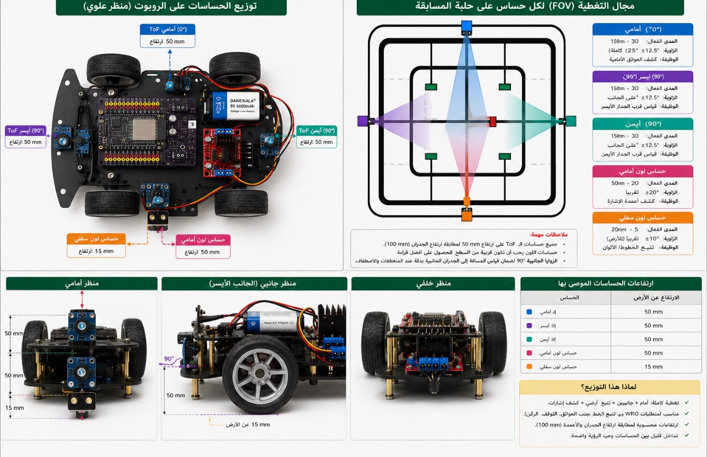

# Power and Sensors

This section documents the electronic architecture of the BirTics robot.

It includes the hardware components responsible for power distribution, sensing, electrical wiring, and controller connections used throughout the development process.

Rather than presenting only the final design, this documentation records the engineering decisions made while integrating the electronic subsystems.

---

# Contents

| Document | Description |
|----------|-------------|
| `wiring.md` | Electrical wiring of the robot prototype. |
| `pin-map.md` | Current ESP32 GPIO allocation. |

---

# Electronic Architecture

The robot electronics are centered around an ESP32 DevKit V1.

The ESP32 communicates with all sensors, processes the measured data, and controls the drive motor through the motor driver.

The current prototype includes:

- ESP32 DevKit V1
- Three VL6180X Time-of-Flight sensors
- Two TCS3200 color sensors
- L298N H-Bridge motor driver
- DC drive motor
- Steering servo
- Battery and regulated power supply

---
---

# Sensor Layout

The current sensor placement was selected after several prototype iterations to provide reliable obstacle detection and track perception while satisfying the WRO Future Engineers field dimensions.

The robot uses three VL6180X Time-of-Flight sensors to estimate distances to the walls and obstacles, together with two color sensors used for traffic sign detection and line recognition.

| Sensor | Position | Purpose |
|----------|----------|----------|
| Front ToF | Front center | Detect front obstacles |
| Left ToF | Left side | Measure left wall distance |
| Right ToF | Right side | Measure right wall distance |
| Front Color Sensor | Front | Detect red and green traffic signs |
| Bottom Color Sensor | Bottom | Detect floor markings |

# Design Philosophy

Each electronic subsystem is tested independently before being integrated into the complete robot.

This incremental approach reduces debugging time, simplifies fault isolation, and provides clear documentation of engineering decisions throughout the development process.
