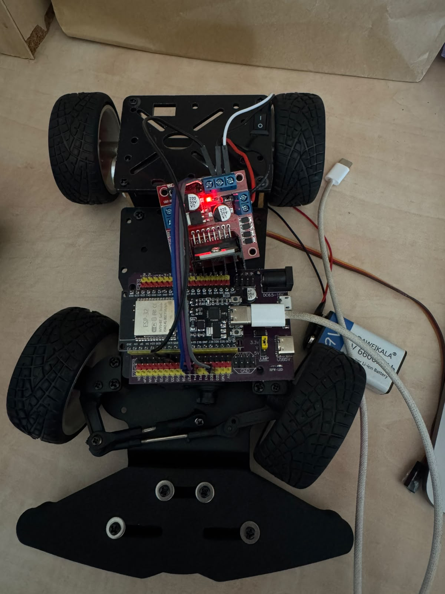
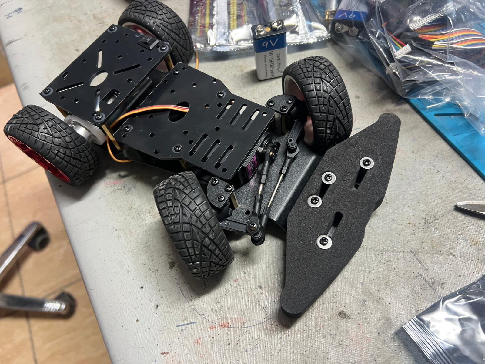
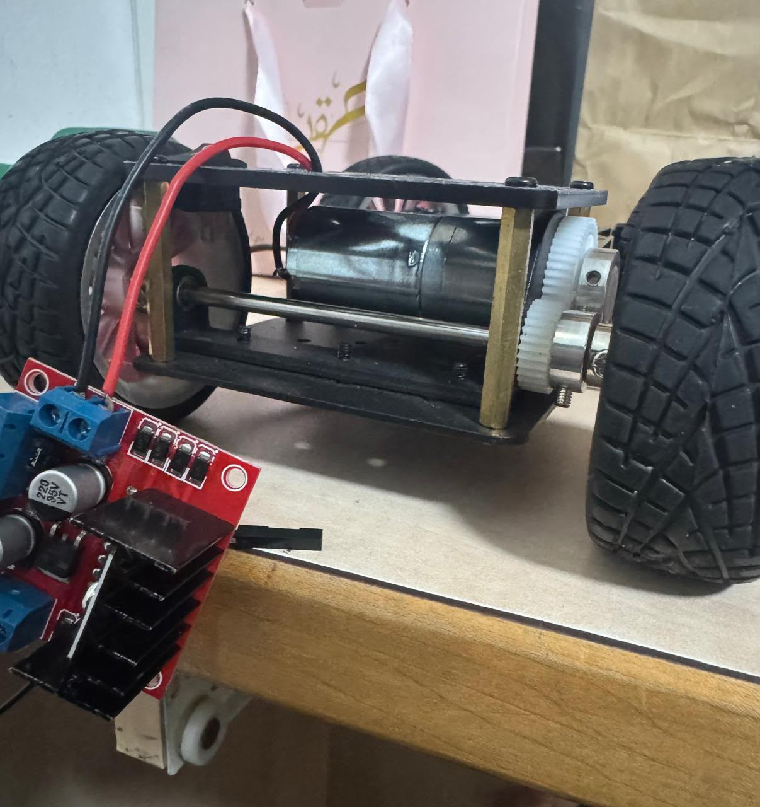

# Electrical Wiring

This document describes the electrical wiring used in the current BirTics robot prototype.

The objective of this document is to document how each electronic subsystem is connected during hardware development and subsystem testing. Since the robot is still under active development, some GPIO assignments and wiring details may change before the final competition version.

---

# System Overview

The electronic system is centered around an **ESP32 DevKit V1** mounted on an expansion shield.

The ESP32 communicates with:

- Three VL6180X Time-of-Flight sensors
- One TCS3200 color sensor (current prototype)
- Second TCS3200 color sensor (planned integration)
- L298N H-Bridge motor driver
- Steering servo
- Rear DC drive motor

Power is supplied by a rechargeable 9 V battery.

---

# Prototype Layout

<p align="center">

</p>

The image above shows the current mechanical prototype during the hardware integration stage.

---

# Prototype Perspective

<p align="center">

</p>

The perspective view illustrates the RC steering mechanism, rear drive assembly, chassis layout, and the available space reserved for the electronic modules.

---

# Battery Placement

<p align="center">

</p>

The battery is currently mounted above the rear drive motor using the upper chassis plate.

This location was selected to:

- shorten the main power wiring,
- simplify power distribution,
- keep the battery easily accessible during testing,
- reserve the front section of the chassis for sensors and future electronics.

The battery position may still be adjusted after complete sensor integration and final weight balancing.

---

# ESP32 Connections

The ESP32 DevKit V1 serves as the central controller of the robot.

It receives measurements from the sensors, processes the collected data, and controls the steering servo and drive motor.

---

# VL6180X Time-of-Flight Sensors

The three VL6180X sensors share a common I²C bus while using independent shutdown pins to prevent address conflicts.

| Signal | ESP32 Pin |
|---------|-----------|
| SDA | GPIO21 |
| SCL | GPIO22 |
| Left SHUT | GPIO25 |
| Center SHUT | GPIO26 |
| Right SHUT | GPIO27 |

Each sensor receives a unique I²C address during initialization.

---

# TCS3200 Color Sensor

The front color sensor is currently connected as follows.

| Signal | ESP32 Pin |
|---------|-----------|
| S0 | GPIO18 |
| S1 | GPIO19 |
| S2 | GPIO16 |
| S3 | GPIO17 |
| OUT | GPIO34 |
| VCC | 3.3 V |
| GND | GND |

The second color sensor will be integrated after the calibration stage and the final mechanical mounting is completed.

---

# L298N Motor Driver

The motor driver has been validated independently before full robot integration.

| L298N | ESP32 |
|--------|-------|
| ENA | GPIO13 |
| IN1 | GPIO14 |
| IN2 | TBD |
| GND | GND |

The rear drive motor is connected to the OUT1 and OUT2 terminals of the driver.

During early standalone testing, GPIO27 was temporarily used for the motor driver.

After integrating the three VL6180X sensors, this pin became permanently reserved for the right sensor shutdown signal.

The final motor-driver GPIO allocation will therefore be updated before complete robot integration.

---

# Power Distribution

The current power flow is organized as follows.

```text
          9 V Battery
               │
               ▼
         Main Power Switch
               │
      ┌────────┴────────┐
      │                 │
      ▼                 ▼
 Voltage Regulator    L298N Driver
      │                 │
      ▼                 ▼
 ESP32 DevKit V1     Rear DC Motor
      │
      ├───────────────► VL6180X Sensors
      ├───────────────► TCS3200 Color Sensor
      └───────────────► Steering Servo
```

All electronic modules share a common ground to ensure stable communication and reliable operation.

---

# Engineering Notes

Several engineering observations were recorded during subsystem integration.

- The three VL6180X sensors successfully share one I²C bus through software address reassignment.
- GPIO27 is permanently reserved for the right VL6180X shutdown pin.
- The second color sensor has not yet been integrated because additional expansion connections and its final mounting location are still under development.
- The power switch and battery wiring are currently being finalized as part of the complete power distribution system.
- The complete wiring layout will be updated after the remaining electronic subsystems are integrated.

---

# Current Wiring Status

| Subsystem | Status |
|-----------|--------|
| ESP32 DevKit V1 | ✅ Operational |
| Expansion Shield | ✅ Operational |
| Three VL6180X Sensors | ✅ Operational |
| L298N Wiring | ✅ Verified |
| Motor Rotation Test | ✅ Completed |
| Front TCS3200 Sensor | 🟡 Calibration in Progress |
| Second TCS3200 Sensor | ⏳ Pending Integration |
| Power Switch Wiring | 🔄 Under Development |
| Complete Robot Wiring | 🔄 Under Integration |
